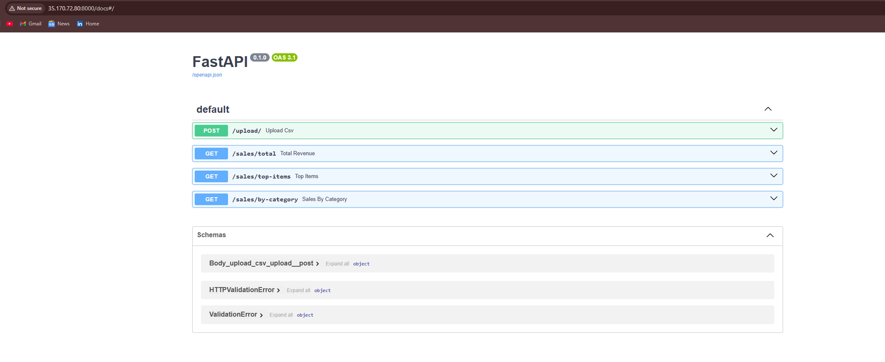
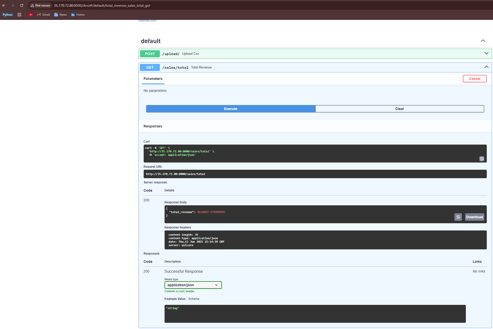
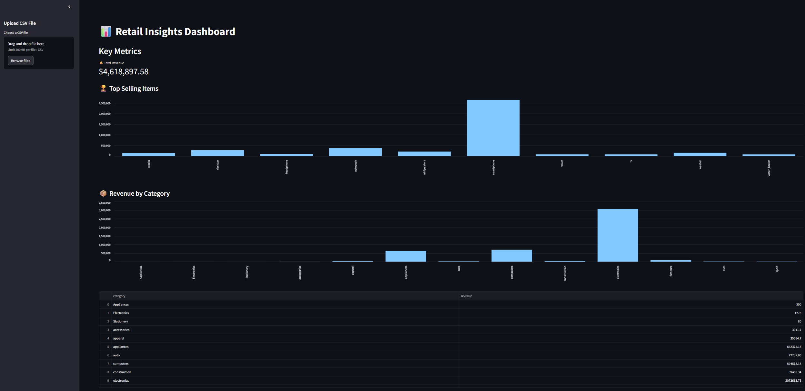

# 📊 Retail Insights Platform

A full-stack data analytics platform that allows users to upload retail sales data, generate RESTful insights via FastAPI, and visualize metrics using an interactive Streamlit dashboard — all containerized with Docker and deployed on AWS EC2.

---

## 🧰 Tech Stack

| Layer        | Technology              |
|--------------|--------------------------|
| Backend      | FastAPI, Uvicorn         |
| Frontend     | Streamlit                |
| Data Handling| Pandas, SQLite           |
| DevOps       | Docker, Docker Compose   |
| Deployment   | AWS EC2 (Ubuntu 22.04)   |

---

## 📂 Project Structure

```
retail-insights-platform/
├── app/                   # FastAPI backend
│   ├── main.py
│   ├── models.py
│   ├── crud.py
│   ├── schemas.py
│   └── routes/insights.py
├── dashboard/             # Streamlit dashboard
│   ├── dashboard.py
│   └── Dockerfile
├── retail.db              # SQLite database (volume mounted)
├── Dockerfile             # FastAPI Dockerfile
├── docker-compose.yml     # Compose for API + dashboard
├── requirements.txt
└── .env                   # Environment variables
```

---

## ⚙️ Features

✅ Upload CSV of retail transactions  
✅ RESTful API endpoints for:
- Total Revenue
- Top 10 Items by Revenue
- Revenue by Category  
✅ Interactive bar charts and tables using Streamlit  
✅ Single-command deployment with Docker Compose  
✅ Accessible over internet via AWS EC2  

---

## 🧪 Sample CSV Format

```
✅ DataFile is added in the data folder
```

---

## 🐳 How to Run Locally (with Docker)

```bash
# From the root of the project
docker-compose up --build
```

Then open:
- `http://localhost:8000/docs`
- `http://localhost:8501`

---

## 🌍 How to Deploy on AWS EC2

1. Launch EC2 (Ubuntu 22.04)
2. SSH into instance
3. Install Docker + Docker Compose
4. Clone this repo & set `.env`
5. Run:
   ```bash
   docker-compose up --build -d
   ```

---

## 📈 Future Improvements

- Add login/authentication
- Upload file history & pagination
- PostgreSQL instead of SQLite
- Unit tests + GitHub Actions CI/CD
- NGINX reverse proxy + HTTPS

---

## 🙋‍♂️ Author

Made with 💡 by [Rakshit Varu](https://www.linkedin.com/in/rakshitvaru/)

---

## 🚀 Live Demo
- **EC2 Hosted Streamlit Dashboard and FastAPI Docs**






---